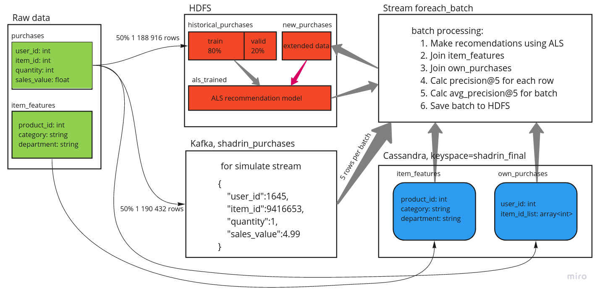

## Урок 8. Spark Streaming + Spark ML + Cassandra. Применение ML-модели в режиме реального времени.

### Содержание  

- [Задание.](#task)  
- [Описание концепции.](#short-description)  
- [Подготовка и очистка данных.](#prepare-data-local)  
- [Создание таблиц и топиков в кластере.](#table-creation-at-cluster)
  * [Копирование данных на кластер.](#copy-data-to-cluster)
  * [Создание таблиц в Кассандре.](#create-cassandra-table)
  * [Разбиение датафрейма и создание топика тестовых данных.](#split-train-test-data)
- [Создание модели рекомендаций ALS.](#creation-als-model)
- [Применение модели в стриминге.](#apply-als-at-stream)
- [Выводы. ](#conclusion)


<a name="task"/>

### Задание. 

В качестве итоговой работы необходимо написать свою ML модель. Обучить ее. Затем применять на стриме. Необходимо найти / сгененрировать собственные входные данные и объяснить, какую задачу решает ваша ML модель и почему именно так.

<a name="short-description"/>

### Описание концепции.

В интернет-магазине пользователь добавляет товар в корзину. Нужно порекомендовать пользователю пять дополнительных товаров. Факт добавления товара в корзину нужно сохранить на HDFS вместе со списком выданных рекоммендаций и метрикой точночности сделанных рекомендаций. Метрику хранить не обязательно, так как в продакшене её нельзя измерить сразу, нужно подождать какое-то время.
 
Есть датафрейм описания фичей товаров, который будет храниться в Кассандре. 
 
Так же в Кассандре хранится датафрейм собственных покупок пользователя. Он понадобится для вычислении ML-метрики.
 
В качестве ML-метрики используется точность рекомендаций - доля фактически купленных товаров из числа порекомендованных.
 
Есть датафрейм `purchases` с исходными данными. В каждой строчке - id пользователя, id товара, количество и цена товара. 
 
Исходняй датафрейм был разбит 50/50 для обучения модели рекомендаций ALS и для иммитации действий пользователя. Для иммитации стрима используется топик в кафке. Так как все новые записи сохраняются на HDFS, то их можно использовать для последущего обучения модели (на графике - красная стрелочка, по факту это не реализовывалось).



<a name="prepare-data-local"/>

### Подготовка и очистка данных.
В датафрейме покупок `purchases` изначально было 2396804 записей. Из их числа были отсеяны записи, где число купленных товаров или сумма заказа была равна нулю. Осталось 2379348 записи.

    user_id - id пользователя, который совершил покупку;
    item_id - id купленного товара;
    quantity - количество товаров в заказе;
    sales_value - суммарная стоимость заказа.

Здесь нет id корзины, так как мы её не используем. Идея такая что каждая запись это факт добавления пользователем товара в свою корзину.

В датафрейме фичей товаров изначально было 92353 уникальных товара. Эти фичи будем хранить в Кассандре. Для экономии места число товаров было уменьшено до 5000. Выбраны наиболее часто покупаемые товары по количеству (`quantity`) среди товаров, цена которых более 1$. Так же были отброшены все лишние фичи товаров, которые не участовуют в процессе рассчёта рекомендаций.
 
 ```python
top_5000 = purchases[purchases.sales_value / purchases.quantity >= 1] \
    .groupby('item_id')['quantity'].sum() \
    .reset_index() \
    .sort_values('quantity', ascending=False) \
    .head(5000) \
    .item_id.tolist()

item_features = item_features[item_features['product_id'].isin(top_5000)]
```

Структура датафрейма `item_features`:
 
    product_id - id товара
    department - категория товара (21 уникальное значение)
    category - подкатегория товара (202 уникальных значения)
    
Так же был составлен датафрейм `top_5_by_category`. В этом датафрейме всего один столбец `product_id` и 5 записей. Это выжимка из `top_5000`, но только товаров из разных категорий. Изначально редполагалось хранить в кассандре и выдавать пользователю, если он купил товар не из топ-5000, но оказалось что модель ALS выдаёт случайные рекомендации, если id товара нет в user-item матрице. Так же этот список топ-5 можно было бы использовать как бэйзлайн рекомендаций для нового пользователя (проблема холодного старта), вместо случайных рекомендаций от ALS. Это дало бы небольшой прирост в качестве модели.  
    
Все эти преобразования были сделаны на локальной машине. Весь код в файле .

<a name="table-creation-at-cluster"/>

### Создание таблиц и топиков в кластере.

<a name="copy-data-to-cluster"/>

#### Копирование данных на кластер.

Скопируем подготовленные файлы на удаленный сервер с помощью команды `scp`. Эта команда запускается на локальном компьютере, а не на удалённом сервере.  
```bash
scp -i ~/.ssh/id_rsa_gb_spark -r ./final_project/data BD_274_ashadrin@89.208.223.141:~/
```

Подключаемся к серверу.
```bash
ssh BD_274_ashadrin@89.208.223.141 -i ~/.ssh/id_rsa_gb_spark
```

Проверяем что файлы загрузились.
```bash
[BD_274_ashadrin@bigdataanalytics-worker-0 ~]$ ls -lah  data/
    
    total 44M
    drwxrwxr-x 2 BD_274_ashadrin BD_274_ashadrin 4,0K янв 16 17:50 .
    drwx------ 7 BD_274_ashadrin BD_274_ashadrin 4,0K янв 16 17:50 ..
    -rw-r--r-- 1 BD_274_ashadrin BD_274_ashadrin 153K янв 16 17:50 item_features.csv
    -rw-r--r-- 1 BD_274_ashadrin BD_274_ashadrin  44M янв 16 17:51 purchases.csv
    -rw-r--r-- 1 BD_274_ashadrin BD_274_ashadrin   49 янв 16 17:50 top_5_by_category.csv
```

Копируем файлы на HDFS.
```bash
[BD_274_ashadrin@bigdataanalytics-worker-0 ~]$ hdfs dfs -put data ./
```

Проверим что все файлы попали на HDFS.
```bash
[BD_274_ashadrin@bigdataanalytics-worker-0 ~]$ hdfs dfs -du -h data

    152.6 K  457.7 K  data/item_features.csv
    43.0 M   129.1 M  data/purchases.csv
    49       147      data/top_5_by_category.csv
```

<a name="create-cassandra-table"/>

#### Создание таблиц в Кассандре.

Запускаем консольный клиент Кассандры
```bash
[BD_274_ashadrin@bigdataanalytics-worker-2 ~]$ /cassandra/bin/cqlsh 10.0.0.18
```

Создаём новое пространство таблиц `shadrin_final`.

```sql
CREATE KEYSPACE IF NOT EXISTS shadrin_final 
WITH REPLICATION = { 
   'class' : 'SimpleStrategy', 
   'replication_factor' : 1 
  };
```

Создаём таблицу фичей товаров.

```sql
CREATE TABLE IF NOT EXISTS shadrin_final.item_features (
    product_id int,
    department text,
    category text,
    primary key (product_id)
);
```

Создаём таблицу собственных покупок пользователя. Эта таблица поможет посчитать точность рекомендаций `precision@5` в микробатче сразу с рассчётом рекомендаций. Сюда попадут все данные о покупках из датасета `purchases.csv`. 

```sql
CREATE TABLE IF NOT EXISTS shadrin_final.own_purchases (
    user_id int,
    item_id_list list<int>,
    primary key (user_id)
);
```

Создаём таблицу с бэйзлайнами. Тут будет две записи: топ 5 популярных покупок и 5 случайных товаров. UPD: Это не использовал.

```sql
CREATE TABLE IF NOT EXISTS shadrin_final.baseline (
    name text,
    list list<int>,
    primary key (name)
);
```

Далее выполним код из файла `init_cassandra_tables.py`. Воспользуемся для этого новым терминалом. 

Проверяем как записались данные в Кассандру.
```sql
select * from shadrin_final.item_features where product_id = 818981;

     product_id | category    | department
    ------------+-------------+------------
         818981 | COLD CEREAL |    GROCERY
```

```sql
select * from shadrin_final.own_purchases where user_id = 2375;

     user_id | item_id_list
    ---------+--------------------------------
        2375 | [828370, 827919, 997200, ... ]
```
Тут я обрезал вывод. Собственных покупок пользователей очень много.

```sql
select * from shadrin_final.baseline;

     name     | list
    ----------+-----------------------------------------------
     random_5 | [1185870, 1492723, 8019418, 894845, 12814320]
        top_5 |   [995242, 1082185, 1127831, 5569230, 951590]
```

В итоге получили заполненные таблички. Выходим из терминала Кассандры командой `exit;`. 

<a name="split-train-test-data"/>

#### Разбиение датафрейма и создание топика тестовых данных.

Создадим топик `shadrin_purchases` с одной партицией и фактором репликации 2. Время жизни топика не ограничено. Этот топик будет использоваться для иммитации покупок пользователей в реальном времени.

```bash
[BD_274_ashadrin@bigdataanalytics-worker-0 ~]$ /usr/hdp/3.1.4.0-315/kafka/bin/kafka-topics.sh --create --topic shadrin_purchases --zookeeper bigdataanalytics-worker-0.novalocal:2181 --partitions 1 --replication-factor 2 --config retention.ms=-1

     Created topic "shadrin_purchases".
```

Запускаем pyspark и последовательно выполняем команды из файла `split_data.py`. 

```bash
[BD_274_ashadrin@bigdataanalytics-worker-0 ~]$ /spark2.4/bin/pyspark --packages org.apache.spark:spark-sql-kafka-0-10_2.11:2.4.5,com.datastax.spark:spark-cassandra-connector_2.11:2.4.2 --driver-memory 512m --driver-cores 1 --master local[1]
```

<details>
<summary>Содержимое файла split_data.py.</summary>
<pre>
<code>
# coding=utf-8
from pyspark.sql import SparkSession
from pyspark.sql.types import StructType, IntegerType, FloatType
from pyspark.sql import functions as F
import subprocess

spark = SparkSession.builder.appName("shadrin_final_topic_spark").getOrCreate()

\######################################################################
\# Разбиваем датафрейм на тренировочный и тестовый 50/50
\######################################################################
schema_purchases = StructType() \
    .add("user_id", IntegerType()) \
    .add("item_id", IntegerType()) \
    .add("quantity", IntegerType()) \
    .add("sales_value", FloatType())

purchases = spark \
    .read \
    .format("csv") \
    .schema(schema_purchases) \
    .options(header=True) \
    .load('data/purchases.csv')

shuffled = purchases.orderBy(F.rand())
train, test = shuffled.randomSplit([0.5, 0.5])
train = train.orderBy(F.rand())
test = test.orderBy(F.rand())


\######################################################################
\# Сохраняем train и test на HDFS в разные папки
\######################################################################

\# на всякий случай
subprocess.call(["hdfs", "dfs", "-rm", "-r", "for_topic"])
subprocess.call(["hdfs", "dfs", "-rm", "-r", "historical_purchases"])

test.repartition(1).write.csv("for_topic")
train.repartition(1).write.parquet("historical_purchases")

train.count()
\# 1188916

test.count()
\# 1190432

\######################################################################
\# Записываем тестовые данные в топик shadrin_purchases
\######################################################################

\# читаем файлы
raw_files = spark \
    .read \
    .format("csv") \
    .schema(schema_purchases) \
    .load('for_topic')

\# указываем одну из нод с кафкой
kafka_brokers = "bigdataanalytics-worker-0.novalocal:6667"

\# пишем файл в Кафку
raw_files.selectExpr("CAST(null AS STRING) as key", "to_json(struct(*)) AS value") \
    .write \
    .format("kafka") \
    .option("topic", "shadrin_purchases") \
    .option("kafka.bootstrap.servers", kafka_brokers) \
    .save()


\######################################################################
\# Проверяем, что записалось в топик
\######################################################################
raw_purchases = spark.readStream. \
    format("kafka"). \
    option("kafka.bootstrap.servers", kafka_brokers). \
    option("subscribe", "shadrin_purchases"). \
    option("startingOffsets", "earliest"). \
    option("maxOffsetsPerTrigger", "10"). \
    load()

parsed_purchase = raw_purchases \
    .select(F.from_json(F.col("value").cast("String"), schema_purchases).alias("value"), "offset") \
    .select("value.*", "offset")


def console_output(df, freq):
    return df.writeStream \
        .format("console") \
        .trigger(processingTime='%s seconds' % freq) \
        .options(truncate=False) \
        .start()


stream = console_output(parsed_purchase, 5)
stream.stop()
</code>
</pre>
</details>

Здесь происходит запись тестовых данных в куфку. В топик `shadrin_purchases` пишется только половина исходного датафрейма, это примерно 1189674 записи. В соседнем терминале проверим, как записались данные.
 
```bash
/usr/hdp/3.1.4.0-315/kafka/bin/kafka-console-consumer.sh --topic shadrin_purchases --from-beginning --bootstrap-server bigdataanalytics-worker-0.novalocal:6667
```

Конец вывода:

    {"user_id":1645,"item_id":9416653,"quantity":1,"sales_value":4.99}
    {"user_id":1114,"item_id":1067494,"quantity":1,"sales_value":4.59}
    {"user_id":20,"item_id":984669,"quantity":1,"sales_value":2.29}
    {"user_id":1798,"item_id":8019562,"quantity":1,"sales_value":2.99}
    {"user_id":591,"item_id":945779,"quantity":3,"sales_value":3.0}
    Processed a total of 1190432 messages

В датафрейме `test` было 1190432 записи. Именно столько и записалось в топик. В датафрейме `train` было 1188916 записи. Данные из `train` будут использованы для обучения модели.

После чтения топика в консоль, в спарке наблюдаю микробатчи:

    -------------------------------------------
    Batch: 10
    -------------------------------------------
    +-------+-------+--------+-----------+------+
    |user_id|item_id|quantity|sales_value|offset|
    +-------+-------+--------+-----------+------+
    |2186   |1124971|1       |3.11       |100   |
    |265    |835098 |1       |3.14       |101   |
    |937    |943737 |1       |3.33       |102   |
    |232    |1002558|1       |1.79       |103   |
    |2411   |1011926|1       |2.5        |104   |
    |2139   |5565664|1       |2.0        |105   |
    |2395   |8090440|1       |6.99       |106   |
    |1868   |854042 |1       |1.0        |107   |
    |2124   |1082185|1       |0.71       |108   |
    |1366   |879152 |1       |1.0        |109   |
    +-------+-------+--------+-----------+------+

Теперь можно удалить папку `for_topic`, так как топик, симулирующий активность пользователей, создан успешно.

```bash
[BD_274_ashadrin@bigdataanalytics-worker-0 ~]$ hdfs dfs -rm -r for_topic
```

<a name="creation-als-model"/>

### Создание модели рекомендаций ALS.

На данном этапе данные для обучения модели находятся в папке `historical_purchases` на HDFS, в фармате parquet. Эти данные мы делим на тренировочные и валидационные (80/20). На валидационных данных будем контролировать переобучение модели. 

В качестве ML-метрики выбрал precision@k - доля рекомендованных товаров среди фактически купленных. 

В ячейках user-item матрицы стоит количество покупок товара пользователем `quantity`, а не стоимость покупки `sales_value`. Предполагается что бизнесовая задача состоит в том чтобы пользователь чаще покупал товары, которые мы рекомендуем. Так можно докрутить модель и рекомендовать товары собственной торговой марки (СТМ), маржинальность которых гораздо выше чем у обычных товаров. То есть стоимость покупки не то же самое что выручка магазина с покупки.
 
Код для обучения модели ALS находится в файле `train_model.py`. 


<details>
<summary>Содержимое файла train_model.py.</summary>
<pre>
<code>
# coding=utf-8
from pyspark.sql import SparkSession
from pyspark.sql.types import StructType, IntegerType, FloatType
from pyspark.ml.recommendation import ALS
from pyspark.sql import functions as F

spark = SparkSession.builder.appName("shadrin_final_model_spark").getOrCreate()

\######################################################################
\# Разбиваем датафрейм на тренировочный и валидационный 80/20
\######################################################################
schema_purchases = StructType() \
    .add("user_id", IntegerType()) \
    .add("item_id", IntegerType()) \
    .add("quantity", IntegerType()) \
    .add("sales_value", FloatType())

data = spark \
    .read \
    .format("parquet") \
    .schema(schema_purchases) \
    .load('historical_purchases')

train, valid = data.randomSplit([0.8, 0.2])

\# Собственные покупки пользователя
own_purchases = data \
    .groupBy(F.col("user_id")) \
    .agg(F.array_distinct(F.collect_list("item_id")).alias("own"))


\# Метрика precision@k показывает какую долю рекомендованных товаров покупал пользователь.
def precision_at_k (recs, own):
    flags = [1 if i in own else 0 for i in recs]
    return sum(flags) / float(len(recs))


precision_at_k_udf = F.udf(precision_at_k)

\######################################################################
\# Обучаем модель
\######################################################################
als = ALS(maxIter=10,
          regParam=0.1,
          userCol="user_id",
          itemCol="item_id",
          ratingCol="quantity",
          coldStartStrategy="drop")

model = als.fit(train)

k = 5

users_train = train.select(als.getUserCol()).distinct()
users_valid = valid.select(als.getUserCol()).distinct()

train_result = model.recommendForUserSubset(users_train, k) \
    .selectExpr("user_id", "recommendations.item_id as recs") \
    .join(own_purchases, on=['user_id'], how="left") \
    .withColumn("precision_at_k", precision_at_k_udf(F.col("recs"), F.col("own")))  \
    .agg({"precision_at_k": "avg"})
train_result.show()

valid_result = model.recommendForUserSubset(users_valid, k) \
    .selectExpr("user_id", "recommendations.item_id as recs") \
    .join(own_purchases, on=['user_id'], how="left") \
    .withColumn("precision_at_k", precision_at_k_udf(F.col("recs"), F.col("own")))  \
    .agg({"precision_at_k": "avg"})
valid_result.show()

\# Сохраняем модель
model.save("als_trained")
</code>
</pre>
</details>


По результатам обучения получили точность `precision@k` на тренировочной выборке `0.0830`, на валидационной выборке `0.0832`. Модель не переобучилась и точность около 8%. Считаю что это удовлетворительный результат. Модель была сохранена в папку `als_trained`.

```bash
[BD_274_ashadrin@bigdataanalytics-worker-0 ~]$ hdfs dfs -ls als_trained

    Found 3 items
    drwxr-xr-x   - BD_274_ashadrin BD_274_ashadrin          0 2021-01-17 23:01 als_trained/itemFactors
    drwxr-xr-x   - BD_274_ashadrin BD_274_ashadrin          0 2021-01-17 23:01 als_trained/metadata
    drwxr-xr-x   - BD_274_ashadrin BD_274_ashadrin          0 2021-01-17 23:01 als_trained/userFactors
```

<a name="apply-als-at-stream"/>

### Применение модели в стриминге.

Далее создаем стрим чтения данных из топика `shadrin_purchases`, подтягиваем датафрейм фичей товаров `item_features` и датафрейм собственных покупок пользователя `own_purchases` из Кассандры. Датафрейм собственных покупок нужен для того, чтобы посчитать метрику `average_precision@k`. 

В методе `foreach_batch_function` мёржим два датафрейма, считаем метрику и выводим на консоль результат. Пример вывода: 

    +-------+-------+--------+-----------+------+--------------------+--------------+--------------------+----------+
    |item_id|user_id|quantity|sales_value|offset|                recs|precision_at_k|            category|department|
    +-------+-------+--------+-----------+------+--------------------+--------------+--------------------+----------+
    |5563693|   1507|       1|       3.99|    95|[6544236, 731106,...|           0.0|            TOMATOES|   PRODUCE|
    | 822786|   1975|       2|      31.98|    19|[6544236, 5845857...|           0.2|                null|      null|
    | 953476|   2479|       1|       0.44|    34|[6544236, 5845857...|           0.2|                null|      null|
    | 862799|   1653|       1|       6.49|    44|[6544236, 5845857...|           0.0|              COFFEE|   GROCERY|
    | 847982|   1823|       1|       1.99|    30|[6544236, 5845857...|           0.2|           SALAD MIX|   PRODUCE|
    | 892004|   2484|       2|        1.5|    24|[6544236, 5845857...|           0.2|                null|      null|
    | 833025|   1621|       1|       1.16|    59|[6544236, 5668996...|           0.0|    MILK BY-PRODUCTS|   GROCERY|
    |1082185|    332|       1|       1.11|    93|[6544236, 731106,...|           0.0|      TROPICAL FRUIT|   PRODUCE|
    | 868206|    831|       1|      11.89|     6|[731106, 6544236,...|           0.0|                null|      null|
    | 916122|   2322|       1|       6.31|    38|[6544236, 731106,...|           0.4|             CHICKEN|      MEAT|
    |1052912|   2168|       1|        1.0|    71|[6544236, 420647,...|           0.0|           SALAD MIX|   PRODUCE|
    | 991932|    409|       1|        2.5|    64|[6544236, 5845857...|           0.2|                null|      null|
    |1081111|    604|       1|        1.0|    79|[6544236, 5668996...|           0.0|                null|      null|
    | 888532|     93|       1|       1.79|    33|[6544236, 5845857...|           0.2|                SOUP|   GROCERY|
    |1126899|    539|       1|       1.99|    35|[6544236, 5845857...|           0.0| FLUID MILK PRODUCTS|   GROCERY|
    |1053763|    725|       1|        0.2|    51|[6544236, 731106,...|           0.0|                null|      null|
    | 921744|    654|       1|        2.0|    37|[6544236, 731106,...|           0.0|          BAG SNACKS|   GROCERY|
    |1079941|   1944|       1|       2.99|    26|[6544236, 5845857...|           0.2|                null|      null|
    |1103741|   2284|       1|       1.59|    29|[6544236, 6533889...|           0.2|FRUIT - SHELF STABLE|   GROCERY|
    | 950988|    132|       1|       1.29|    12|[6544236, 5845857...|           0.2|                null|      null|
    +-------+-------+--------+-----------+------+--------------------+--------------+--------------------+----------+
    only showing top 20 rows
    
    avg_precision_at_k:  0.117525773196                                             
    duration:  42.9748260975  

<details>
<summary>Содержимое файла apply_model.py.</summary>
<pre>
<code>
# coding=utf-8
from pyspark.sql import SparkSession
from pyspark.sql.types import StructType, IntegerType, FloatType
from pyspark.ml.recommendation import ALSModel
from pyspark.sql import functions as F
import time


spark = SparkSession.builder.appName("shadrin_final_foreach_spark").getOrCreate()

\# указываем одну из нод с кафкой
kafka_brokers = "bigdataanalytics-worker-0.novalocal:6667"

\# загружаем модель
model_path = "als_trained"
model = ALSModel.load(model_path)
\######################################################################
\# Загружаем модель и сопутствующие датафреймы.
\######################################################################


\# Метрика precision@k показывает какую долю рекомендованных товаров покупал пользователь.
def precision_at_k(recs, own):
    flags = [1 if i in own else 0 for i in recs]
    return sum(flags) / float(len(recs))


precision_at_k_udf = F.udf(precision_at_k)

\# Количество рекомендаций
k = 5

\# Датафрейм с собственными покупками, для измерения качества рекомендаций
cass_own_purchases = spark.read \
    .format("org.apache.spark.sql.cassandra") \
    .options(table="own_purchases", keyspace="shadrin_final") \
    .load()

\# Датафрейм с описанием товаров
cass_item_features = spark.read \
    .format("org.apache.spark.sql.cassandra") \
    .options(table="item_features", keyspace="shadrin_final") \
    .load()


def foreach_batch_sink(df, freq):
    return df \
        .writeStream \
        .foreachBatch(foreach_batch_function) \
        .trigger(processingTime='%s seconds' % freq) \
        .start()


def foreach_batch_function(df, epoch_id):
    start_time = time.time()
    # df
    user_ids = df.select("user_id").distinct()
    # python list
    user_ids_list = user_ids.select('user_id') \
        .rdd.flatMap(lambda x: x) \
        .collect()
    #
    own_purchases = cass_own_purchases \
        .filter(F.col("user_id").isin(user_ids_list)) \
        .withColumnRenamed("item_id_list", "own")
    #
    train_result = model.recommendForUserSubset(user_ids, k) \
        .selectExpr("user_id", "recommendations.item_id as recs") \
        .join(own_purchases, on=['user_id'], how="left") \
        .withColumn("precision_at_k", precision_at_k_udf(F.col("recs"), F.col("own"))) \
    #
    train_result.persist()
    #
    item_ids_list = df.select("item_id") \
        .distinct() \
        .rdd.flatMap(lambda x: x) \
        .collect()
    #
    item_features = cass_item_features \
        .filter(F.col("product_id").isin(item_ids_list)) \
        .withColumnRenamed("product_id", "item_id")
    #
    extended_df = df \
        .join(train_result.select("user_id", "recs", "precision_at_k"), on=['user_id'], how="left") \
        .join(item_features, on=['item_id'], how="left")
    extended_df.show()
    #
    avg_precision_at_k = train_result \
        .agg({"precision_at_k": "avg"}) \
        .rdd.flatMap(lambda x: x) \
        .collect()[0]
    print "avg_precision_at_k: ", avg_precision_at_k
    # сохраним батч на HDFS
    extended_df.write.mode("append").parquet("new_purchases")
    # выведем время выполнения батча
    duration = time.time() - start_time
    print "duration: ", duration
    train_result.unpersist()


schema_purchases = StructType() \
    .add("user_id", IntegerType()) \
    .add("item_id", IntegerType()) \
    .add("quantity", IntegerType()) \
    .add("sales_value", FloatType())

raw_data = spark.readStream. \
    format("kafka"). \
    option("kafka.bootstrap.servers", kafka_brokers). \
    option("subscribe", "shadrin_purchases"). \
    option("startingOffsets", "earliest"). \
    option("maxOffsetsPerTrigger", "100"). \
    load()

parsed_data = raw_data \
    .select(F.from_json(F.col("value").cast("String"), schema_purchases).alias("value"), "offset") \
    .select("value.*", "offset")


s = foreach_batch_sink(parsed_data, 60)
s.stop()
</code>
</pre>
</details>

Время выполнение микробатча при пачке в 5 записей и 100 записей было примерно одинаковым, 50 секунд. На HDFS появилась папка `new_purchases` с новыми данными. Их можно использовать для повторного обучения модели.

```bash
hdfs dfs -ls new_purchases
    
    Found 3 items
    -rw-r--r--   3 BD_274_ashadrin BD_274_ashadrin          0 2021-01-18 14:41 new_purchases/_SUCCESS
    -rw-r--r--   3 BD_274_ashadrin BD_274_ashadrin       5314 2021-01-18 14:40 new_purchases/part-00000-5ecf093b-25e0-4956-9d18-87f7be02edc1-c000.snappy.parquet
    -rw-r--r--   3 BD_274_ashadrin BD_274_ashadrin       5223 2021-01-18 14:41 new_purchases/part-00000-f941a02d-4239-46e8-8a87-f3a56c0bca51-c000.snappy.parquet
```

Данные в директории можно прогнать через метод `compact_directory`, чтобы они занимали меньше места.

```python
def compact_directory(path):
    df_to_compact = spark.read.parquet(path + "/*.parquet")
    tmp_path = path + "_tmp"
    df_to_compact.write.mode("overwrite").parquet(tmp_path)
    df_to_compact = spark.read.parquet(tmp_path + "/*.parquet")
    df_to_compact.write.mode("overwrite").parquet(path)
    subprocess.call(["hdfs", "dfs", "-rm", "-r", tmp_path])
```

<a name="conclusion"/>

### Выводы. 

Получилось реализовать стриминговую модель рекомендаций с точностью `precision@k = 8%`. Модель обучалась на данных на HDFS. В методе `foreach_batch_function` считается метрика для каждой записи. Данные дополняются фичами купленного товара из Кассандры. Итоговый расширенный датафрейм сохраняется на HDFS. К сожалению, в этом методе не удалось применить запись в Кассандру.  
